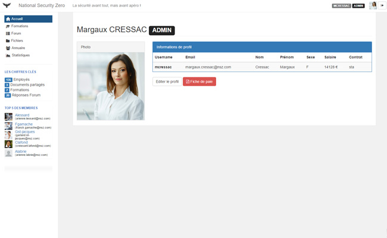
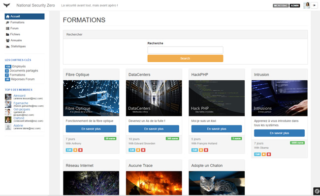
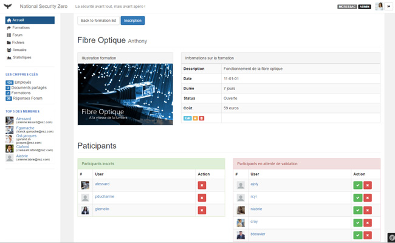
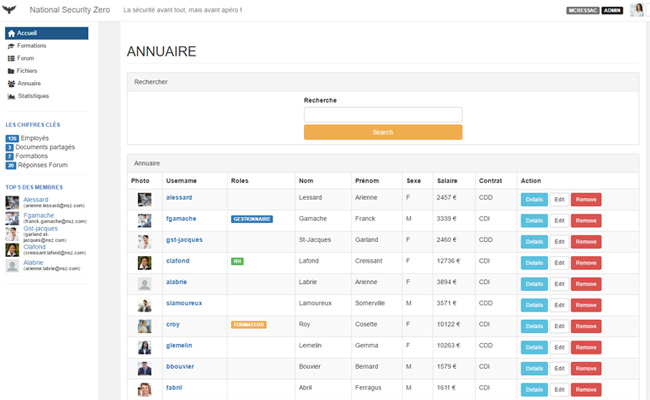
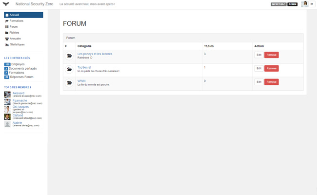
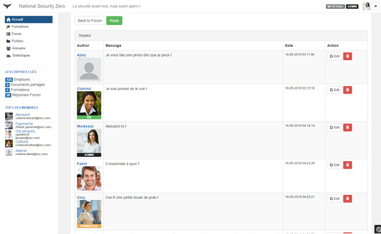
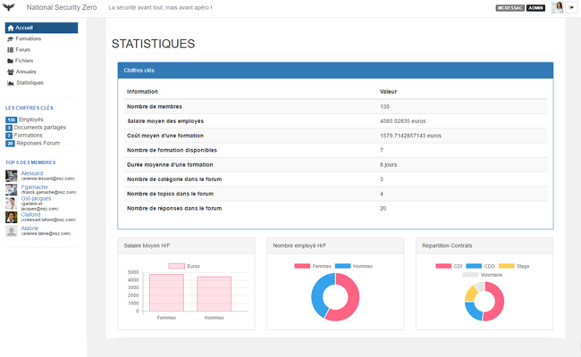
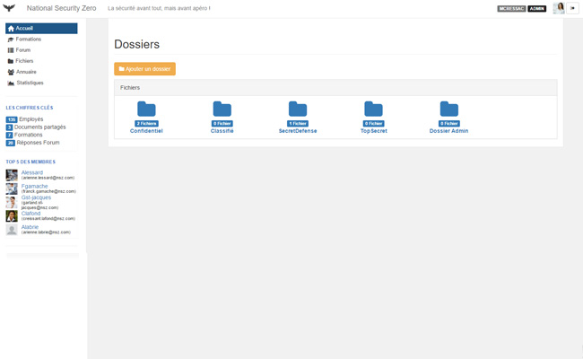
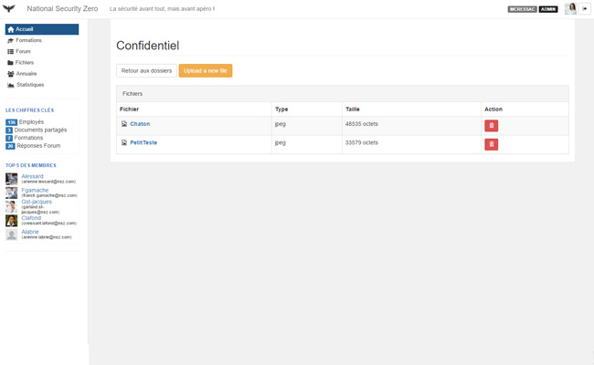
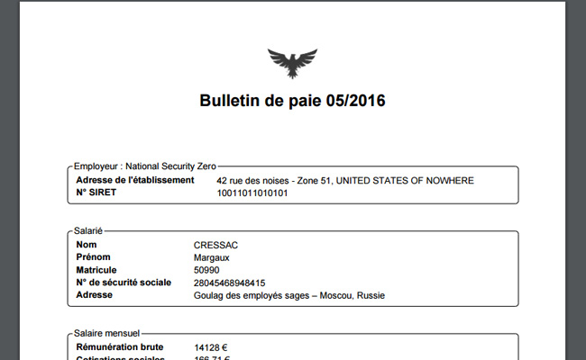

Symfony3 WebProject (National security zero)
====================
## Description
Nous avons créer un bundle pour chaque module implémenté:
* ForumBundle
* UserBundle (extends `FOSUserBundle`)
* FormationBundle (avec `JQueryUI` )
* AnnuaireBundle (avec `JQueryUI` )
* FichierBundle
* StatsBundle (avec `ChartJS`)

## Tester le projet
###Récuperer le repertoire
Avant de commencer il faut télécharger le repertoire. Le mieux étant un `git
clone https://github.com/NightWolfRobot/NationalSecurityZero.git`

###Attention
Veuillez suivre les instructions suivantes : 
* Adaptez le fichier `app/config/parameters.yml` à votre base de données.
* Entrer la commande : `composer update`.

###Base de données
Nous avons mis à disposition un fichier nsz.sql à la racine du projet pour
pouvoir remplir la base de données.
Avant vous devez vous rendre dans le projet et executer la commande :
`php bin/console doctrine:schema:update --force`  
Charger ensuite le fichier `nsz.sql` dans votre base de donnée afin de
l'hydrater. 
Vous pourrez ensuite lancer le server avec `php bin/console server:run`.

###Se connecter
Avant tout comme le site est protéger il vous sera impossible d'acceder aux
diverses pages du site. 
Pour simplifier nous avons donc mis comme mot de passe pour les utilisateurs
leur propre nom.   Ainsi vous pouvez vous logger avec :
* Login: `mcressac` Password: `cressac` (**Admin**)
* Login: `fgamache` Password: `gamache` (**Gestionnaire de Fichiers**)
* Login: `clafond` Password: `lafond` (**Responsable RH**)
* Login `croy` Password: `roy` (**Formateur**)
* Login `nlabrie` Password: `labrie` (**Moderateur**)
 
 
En vous rendant dans l'annuaire une fois connecter, vous pouvez prendre
connaissance des noms et usernames de chaque utilisateur et vous pouvez vous
en servir pour vous connecter avec leur compte.
 
 

##Les membres
 
### Donner/Retirer un role à un membre
Pour attribué un rôle à un membre cela se fait en ligne commande:
* `php bin/console fos:user:promote username ROLE`
* `php bin/console fos:user:demote username ROLE`
* `php bin/console fos:user:promote username --super` *(Droits de
SuperAdmin)*

##Les bundles
###FormationBundle
 
####Recherche
Vous avez la possibilité d'effectuer une recherche avec autocomplétion géré
par `JQueryUI`. En choisissant une proposition autocompletée vous vous
rendez
directement sur la description d'une formation.
####Ajouter une formation
Seul le formateur ou l'admin peuvent **ajouter/editer/supprimer** une
formation.
#### Inscription à la formation
 
Tout membre peut proposer sa participation à une formation, il se trouvera
alors dans une liste en attente de validation. Le formateur ou
l'administrateur pourra alors décider de **valider** l'utilisateur ou
l'**enlever**.
#### Verrouiller une formation
L'administrateur ou le formateur ont la possibilité de **vérouillé** une
formation rendant ainsi les inscriptions impossibes.

###AnnuaireBundle
 
####Recherche
Vous avez la possibilité d'effectuer une recherche avec autocomplétion géré
par `JQueryUI`. En choisissant une proposition autocompletée vous vous
rendez
directement sur la page de profil d'un utilisateur.
####Editer profil
Seul l'**Admin**, le **RH** et l'utilisateur lui même peuvent modifier les
informations relatives à son profil.
####Pagination
Nous avons implémenté une pagination pour avoir 15 utilisateurs par page.

###ForumBundle
####Catégories
 
Le **Modérateur** et l'**Administrateur** ont la possibilité
d'**ajouter/supprimer/editer** une catégorie du forum.
####Topics dans une catégorie
N'importe quel utilisateur peut créer un sujet de discussion, il sera alors
le seul à pouvoir la **supprimer/editer** avec le **Modérateur** et
l'**Administrateur**.
####Topic
 
Tout utilisateur peut poster une réponse à un topic et échanger avec les
autres membres. Ses réponses seront editables et supprimable seulement par lui
même et par le **Modérateur** et l'**Administrateur**.

###StatsBundle
 
Bundle assez simple, tous les membres peuvent se rendre dessus et observer
les différentes statistiques sur les membres. Nous avons utilisé `ChartJS`
pour avoir un meilleur rendu.

###FichierBundle

#### Les dossiers
 
Nous avons mis en place un systeme d'autorisation d'accès pour chaque dossier
. Ainsi à la création nous choisissons à quels roles seront accessible le
dossier. (Seul le **Gestionnaire** et l'**Administrateur** peuvent créer un
dossier).  
Seuls les utilisateurs ayant le role requis par le dossier peuvent y acceder.
 Sauf le **Gestionnaire** qui a accès à tous les dossiers.

####Les Fichiers
  
 Les fichiers sont uploadés vers le dossier `src/web/uploads/` et sont donc
 listé dans les dossiers. Tout le monde ayant accès au dossier peuvent
 uploader un fichier. En revanche une fois en ligne, seul
 l'**Administrateur** et le **Gestionnaire** peuvent le supprimer.

###Géneration fiche de paie en PDF
 
Nous avons utilisé le module `html2pdf` afin de faire un rendu de la fiche de
 paie employé. Seul l'employé concerné, l'Adminsitrateur et le RH peuvent y
  avoir accès. 
 
 Les cotisations sociales sont basées sur la version simplifié trouvée dans
 le lien qui suit.
[Cotisations sociales](https://fr.wikipedia.org/wiki/Cotisations_sociales_en_France#Travailleurs_salari.C3.A9s)

##Services
 Nous avons fait un service afin de pouvoir recueillir dans la base de donnée
  quelques informations nécessaires sur toutes les pages. Par exemple, dans
  notre sidebar nous avons un module `TOP5Membres` ainsi qu'un module `Les
  chiffres clés`. Nous les récupérons via ce service qui se situe dans
  `Acme/GlobalBundle/DBinfo`

## Auteurs
 * Anthony CHAFFOT ([NightWolfRobot](https://github.com/NightWolfRobot))
 * Jessica FAVIN ([JessicaFavin](https://github.com/JessicaFavin))
